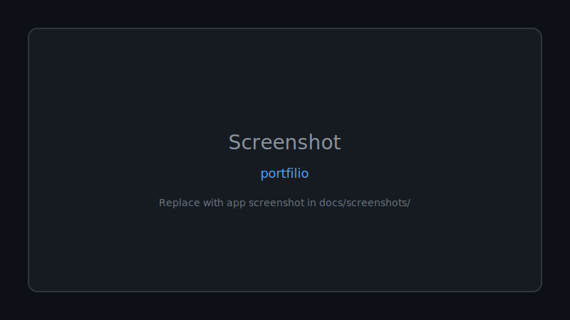

# 🚀 Portfilio

**Portfilio — professional open source project.**

Documented · MIT licensed · Maintained

[Features](#-features) · [Quick Start](#-quick-start) · [Screenshots](#-screenshots) · [Contributing](CONTRIBUTING.md)

---

## 🖼 Screenshots

*Replace `docs/screenshots/placeholder.svg` with real app screenshots.*

---

## 🐍 Contribution graph

<picture>
  <source media="(prefers-color-scheme: dark)" srcset="https://raw.githubusercontent.com/mafzalkalwardev/portfilio/output/snake-dark.svg" />
  <source media="(prefers-color-scheme: light)" srcset="https://raw.githubusercontent.com/mafzalkalwardev/portfilio/output/snake.svg" />
  
</picture>

---

## 🚀 Quick start

Clone the repository and follow project-specific setup in docs.
