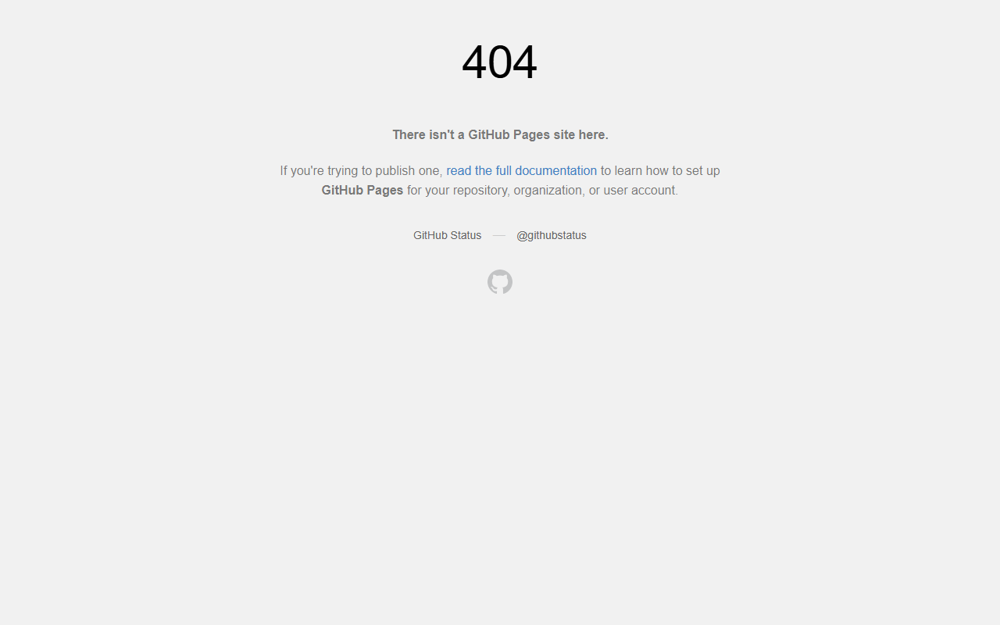



# Portfolio Practice Site

**Portfolio website practice project for experimenting with personal branding, responsive page sections, and GitHub-hosted static pages.**

HTML, CSS, portfolio, GitHub Pages

---

## Screenshots

## Overview

Portfolio website practice project for experimenting with personal branding, responsive page sections, and GitHub-hosted static pages.

## Highlights

- Clean repository documentation with a project-specific summary.
- Screenshot section when captured portfolio media is available.
- Search-friendly tags for portfolio and GitHub discovery.
- Maintained by [Muhammad Afzal Kalwar](https://github.com/mafzalkalwardev).

## Quick Start

Clone the repository and review the source files for setup or usage details:

``bash
git clone https://github.com/mafzalkalwardev/portfilio.git
cd portfilio
``

## Author

Muhammad Afzal Kalwar - Full-Stack Developer and Python Automation Engineer  
Portfolio: https://mafzalkalwardev.github.io
